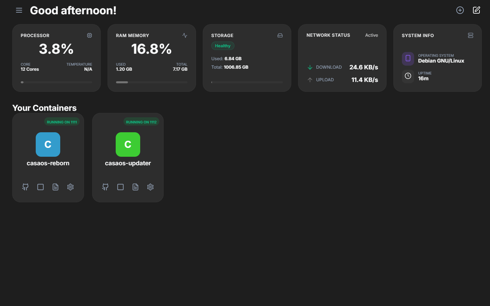

# 🚀 CasaOS Reborn

<div align="center">
  
</div>
CasaOS Reborn is a lightweight, modern, and powerful web-based interface for managing Docker containers. Built as a sleek alternative to CasaOS, it allows you to orchestrate your homelab environment with ease, directly from your browser.

---

## 💖 Support the Project

This project is a labor of love, developed during my free time to provide a better, modern alternative for homelab management. If you find CasaOS Reborn useful and want to help me maintain it, add new features, and keep the coffee flowing, please consider making a donation!

<div align="center">
  <a href="https://paypal.me/LorenzoCassano77" target="_blank">
    
  </a>
</div>

*Every single contribution is deeply appreciated and fuels future development.*

---

## ✨ How it works (Features)

> **Note:** The **File Manager** and **App Store** features are currently built-in but have been temporarily disabled for maintenance and improvements. They will be re-enabled in a future update!

- **Sleek Dashboard & UI**: A modern interface with responsive design. Includes an extensive theming engine with 19 accent colors and 14 background themes (including automatic Light/Dark mode switching).
- **Customizable Layout**: Drag-and-drop to reorder system widgets (CPU, RAM, Disk, Network) and pin or sort your favorite Docker containers.
- **Container Management**: View, start, stop, restart, and delete Docker containers effortlessly.
- **Advanced Configuration**: Edit container settings including environment variables, ports, and volumes on the fly.
- **YAML Import**: Quickly create new containers by pasting a `docker-compose` YAML snippet.
- **Integrated Terminal**: Access a fully-functional web terminal directly from the sidebar.
- **Intelligent Self-Updater**: A robust, built-in self-updating mechanism that verifies image hashes and seamlessly updates its own container without manual intervention or data loss.
- **Persistent Preferences**: All layout and theme settings are safely stored in a local backend JSON file, preserving your customized workspace across all devices.

### 🚀 Roadmap
We are actively working on massive upgrades to turn CasaOS-Reborn into a complete web operating system. The upcoming features include:
1. **Web File Manager**: Browse, manage, upload, and download host files directly from the browser.
2. **Glassmorphism UI**: A complete visual overhaul featuring frosted-glass effects on cards and modals.
3. **Host Control**: Safely Reboot and Shutdown the host machine from the web interface.

*For full details on the upcoming architecture, see the [ROADMAP.md](./ROADMAP.md) file.*

---

## 📦 Installation & Dependencies

### For End Users (Docker Deployment)

**Dependencies:**
To *use* the backend container, the only requirements are **Docker** and **Docker Compose**. You do **not** need Node.js, npm, or any other software installed on your host system.

**Installation Method:**
1. Create a new directory on your server (e.g., `mkdir casaos-reborn && cd casaos-reborn`).
2. Inside that folder, create a file named `docker-compose.yml` and paste the configuration below. Ensure you map the Docker socket correctly and specify a valid host directory to save your configuration persistently.

```yaml
services:
  casaos-reborn:
    image: ghcr.io/lorenzo0010/casaos-reborn:latest
    container_name: casaos-reborn
    privileged: true
    restart: unless-stopped
    ports:
      - "1111:3000"
    volumes:
      - /var/run/docker.sock:/var/run/docker.sock
      # Replace /home/username with your actual server path
      - /home/username/casaos-reborn-config:/app/backend/data
      # Mount host directories to browse them from the File Manager
      - /home:/home
      - /media:/media
      - /mnt:/mnt
    environment:
      - PORT=3000
      - JWT_SECRET=supersecretcasaoskey
      - ADMIN_USER=admin
      - ADMIN_PASS=casaos
      # The "Home" shortcut defaults to /home. Set this if you want to target a specific user folder (e.g. /home/username)
      - HOST_HOMEDIR=/home
```

3. Open your terminal in the same folder and run the following command to start the container in the background:
   ```bash
   docker-compose up -d
   ```
4. Access the web interface at `http://<your-server-ip>:1111` and log in with your credentials.

---

## 🛠 For Developers

**Architecture:**
- **Frontend**: React, Vite, Lucide-React (Icons), xterm.js (Terminal)
- **Backend**: Node.js, Express, Socket.io (Real-time updates), Dockerode (Docker API integration)

**Running and Testing Locally (Full Stack):**
1. **Clone the repository**:
   ```bash
   git clone https://github.com/Lorenzo0010/casaos-reborn.git
   cd casaos-reborn
   ```
2. **Testing via Docker Compose (Recommended)**:
   The easiest way to test the full stack locally is using the local Docker Compose file:
   ```bash
   docker compose -f docker-compose.local.yml up -d --build
   ```
   This will spin up the backend, frontend, and updater containers. You can then access the WebUI at `http://localhost:1111`.

3. **Running without Docker (Manual setup)**:
   - **Backend**:
     ```bash
     cd backend
     npm install
     node server.js
     ```
     *(Requires access to the Docker daemon. On Windows/macOS, ensure Docker Desktop is running).*
   - **Frontend**:
     ```bash
     cd frontend
     npm install
     npm run dev
     ```
     *The frontend will run on a local dev server (usually `http://localhost:5173`) and proxy requests to the backend.*

**Testing Frontend with a Remote Backend:**
If you want to run the UI locally on your development machine (e.g., Windows/macOS) but connect it to your actual server running the CasaOS-Reborn backend:
1. Navigate to the `frontend` folder and create a `.env` file.
2. Add your server's URL like this:
   ```env
   VITE_BACKEND_URL=http://<YOUR_SERVER_IP>:1111
   ```
3. Run the frontend:
   ```bash
   npm install
   npm run dev
   ```
   *The frontend will automatically proxy all API and WebSocket connections to your remote server.*

---

## 🔒 Security & Authentication

The application is protected by a JWT-based authentication system. By default, you can configure your credentials using the `ADMIN_USER` and `ADMIN_PASS` environment variables in your deployment configuration.

---

## ⚖️ License & Disclaimer

This project is open-source and available under the **MIT License**.

> [!WARNING]
> **DISCLAIMER OF LIABILITY**
> This software is provided "AS IS", without warranty of any kind, express or implied. The author assumes no responsibility for any data loss, server downtime, security breaches, or any other damages arising from the use of this software. You are granting this application privileged access to your Docker daemon. **Use it at your own risk.** Always backup your critical data before managing containers through third-party interfaces.

For more details, see the [LICENSE](./LICENSE) file.
